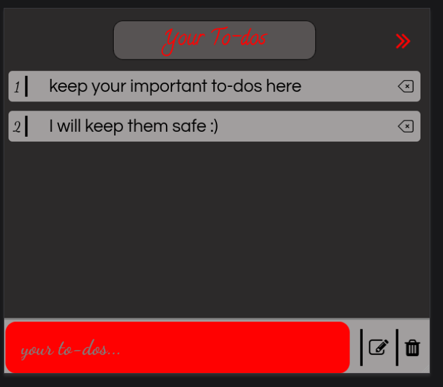
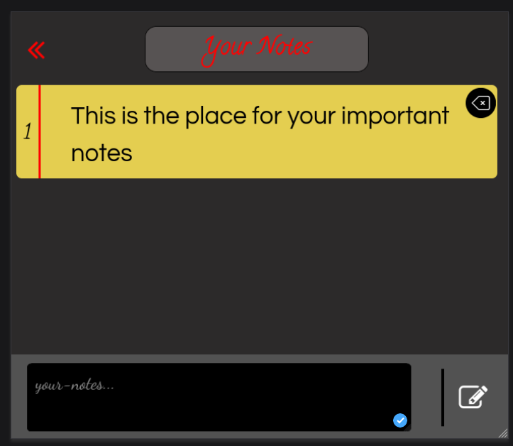

# Assistant-extension

```
This extension/add-on allows you to keep you up-to-date 
with your to-dos and lets you store the important notes
you would want to have
```

You can switch between the to-dos and notes keeper by clicking 
the **arrow buttons** on the top of the extension or simply use the 
keyboard **left** and **right** arrow to navigate between them.

## To-do-list

* You can add, delete individual or whole to-do-list

## Notes-keeper
* It has the same functionality as to-do-list except you can't delete all notes 
at the same time
* After writing the notes you can press **insert** from your keyboard to store it


 ## Installation for chrome/Edge users
 * Download the zip of this repository and unzip it in a folder of your prefered directory
 * Open chrome's extensions page
 * Click on the **load unpacked** option at the top left of the page
 * Now select the folder where you unzipped it previously and press **OK**

## Installation for firefox users
 * https://addons.mozilla.org/en-US/firefox/addon/your-to-do-list-notes-keeper/
 You can install in manually from here
